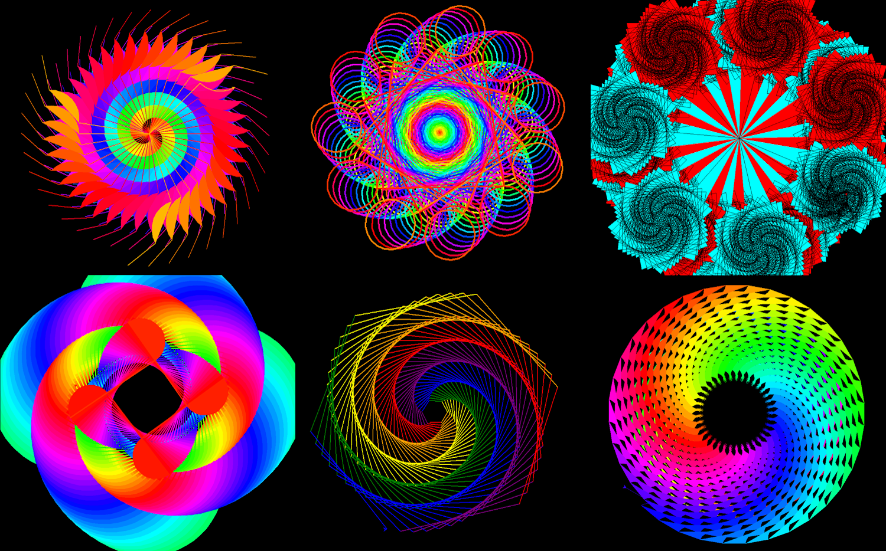

# Python turtle Graphics
Collection of python files I made by playing around with the turtle graphics module in Python 

## Usage
1. Clone this repository:

    ```
    git clone https://github.com/mespino4/Python-Turtle-Graphics
    ```
2. Run the any Python file:

    ```
    python donut.py
    ```

## Screenshots



